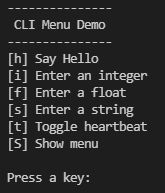

# Command Line Interface
Before I realize an elaborate user interface with TFT display, encoders and 
push buttons for my projects, I test the main functionality with inputs via the 
serial interface. To make this more comfortable I designed a simple menu 
system. It looks like this:



A menu line consists of key, text and action. The key is the button on the keyboard to be pressed, the text, the description for it and the action the 
associated function that is called. 

```
//Definition of a menuitem
typedef struct { const char key; const char *txt; void (&action)(); } MenuItem;
```

The whole menu is now defined like this:
```
// Menu definition
// Each menuitem is composed of a key, a text and an action
MenuItem menu[] = 
{
  { 'h', "[h] Say Hello",        sayHello },
  { 'i', "[i] Enter an integer", enterInteger },
  { 'f', "[f] Enter a float",    enterFloat },
  { 's', "[s] Enter a string",   enterString },
  { 't', "[t] Toggle heartbeat", toggleHeartbeat },
  { 'S', "[S] Show menu",        showMenu },
};
constexpr uint8_t nbrMenuItems = sizeof(menu) / sizeof(menu[0]);
```
As we can see, the processor can also tell us the number of menu items.

In our main loop we look for a keypress and call a function doMenu() 
only when a key was pressd:
```
// handle the menu
if(Serial.available()) doMenu();
```

What does the doMenu() function do?
```
void doMenu()
{
  char key = Serial.read();
  Serial.print(CLR_LINE);
  for (int i = 0; i < nbrMenuItems; i++)
  {
    if (key == menu[i].key)
    {
      menu[i].action();
      break;
    }
  } 
}
```
It reads the character of the pressed key, looks in a for loop if the key is 
present and executes the corresponding action if it is found. From doMenu() it 
immediately returns to the main loop if the action is finished or if no valid 
keystroke was found.
