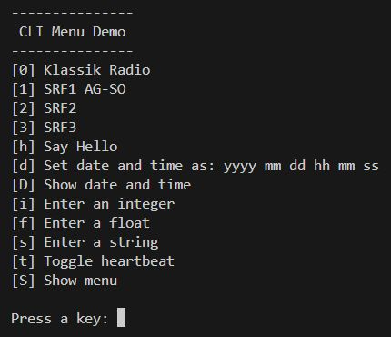

# Command Line Interface
Before I realize an elaborate user interface with TFT display, encoders and 
push buttons for my projects, I test the main functionality with inputs via the 
serial interface. To make this more comfortable I designed a simple menu 
system. It looks like this:



A menu line consists of a key, a text, an actionargument and an action. The 
key is the button on the keyboard to be pressed, the text, the description for 
it and the action the associated function that is called with the actionargument. 

```
// Definition of the action and the menuitem
using Action   = void(&)(const char*);
using MenuItem = struct mi{ const char key; const char* txt; const char* arg; Action action; };
```

The whole menu is now defined like this:
```
// Menu definition
// Each menuitem is composed of a key, a text, an actionargument and an action
MenuItem menu[] = 
{
  { '0', "[0] Klassik Radio",    "http://stream.klassikradio.de/live/mp3-128/stream.klassikradio.de", playRadio },
  { '1', "[1] SRF1 AG-SO",       "http://stream.srg-ssr.ch/m/regi_ag_so/mp3_128", playRadio },
  { '2', "[2] SRF2",             "http://stream.srg-ssr.ch/m/drs2/mp3_128", playRadio },
  { '3', "[3] SRF3",             "http://stream.srg-ssr.ch/m/drs3/mp3_128", playRadio },  
  { 'h', "[h] Say Hello",        "Guten Tag", sayHello },
  { 'd', "[d] Set date and time as: yyyy mm dd hh mm ss", "", setDateTime },
  { 'D', "[D] Show date and time", "", showDateTime },
  { 'i', "[i] Enter an integer",   "", enterInteger },
  { 'f', "[f] Enter a float",      "", enterFloat },
  { 's', "[s] Enter a string",     "", enterString },
  { 't', "[t] Toggle heartbeat",   "", toggleHeartbeat },
  { 'S', "[S] Show menu",          "", showMenu },
};
constexpr uint8_t nbrMenuItems = sizeof(menu) / sizeof(menu[0]);
```
As we can see, the compiler can also tell us the number of menu items.

In our main loop we look for a keypress and call the function doMenu() 
only when a key was pressd:
```
// handle the menu
if(Serial.available()) doMenu();
```

What does the doMenu() function do?
```
void doMenu()
{
  char key = Serial.read();
  CLEAR_LINE;

  for (int i = 0; i < nbrMenuItems; i++)
  {
    if (key == menu[i].key)
    {
      menu[i].action(menu[i].arg);
      break;
    }
  } 
}
```
It reads the character of the pressed key, looks in a for loop if the key is 
present and executes the corresponding action if it is found. From doMenu() it 
immediately returns to the main loop if the action is finished or if no valid 
keystroke was found.
